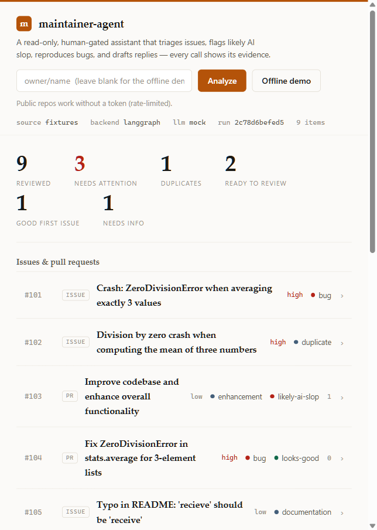
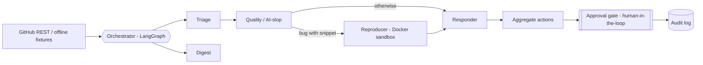

# maintainer-agent

[English](README.md) | [中文](README.zh-CN.md)

**A multi-agent assistant that helps open-source maintainers fight AI slop.**

In 2025-2026, maintainers are drowning in low-effort, AI-generated PRs and issues
(Godot, OCaml, LLVM, and GitHub's own PR rate-limiting are all responses to this).
Existing tooling is mostly *defensive* - filters, caps, throttles. `maintainer-agent`
is the opposite: a **proactive, explainable** assistant that triages, quality-checks,
reproduces, and drafts replies - while keeping a human firmly in the loop.

> Runs fully **offline** out of the box (bundled fixtures + a deterministic
> rule-based model), so you can try the whole pipeline with zero credentials.

---

## Demo



The dashboard runs the full multi-agent pipeline on the bundled demo tracker: it
flags PR #103 / #109 as likely AI slop, catches #102 as a duplicate of #101, and
surfaces security issue #108 - each with expandable evidence and a drafted reply.
See [docs/WRITEUP.md](docs/WRITEUP.md) for the design rationale.

## What it does

A small team of cooperating agents, orchestrated with **LangGraph** (with a
linear fallback), processes each issue/PR:

| Agent | Responsibility |
|-------|----------------|
| **Triage** | Area labels + priority, **duplicate detection** (TF-IDF over the tracker), "needs more info", good-first-issue spotting |
| **Quality / AI-slop** | The headline feature: scores PRs against the repo's `CONTRIBUTING.md` ("job description") using explainable, weighted signals |
| **Reproducer** | Runs a bug report's Python snippet in a locked-down **Docker sandbox** and reports whether it reproduces |
| **Responder** | Drafts a specific, respectful reply from the other agents' findings - never posted without approval |
| **Digest** | A 30-second maintainer summary: what needs attention, duplicates, ready-to-review, good first issues |

Cross-cutting design (the parts that make it trustworthy):

- **Explainability** - every decision carries a verdict, confidence, and a list of weighted `Evidence`.
- **Human-in-the-loop** - dry-run by default; nothing is posted without explicit `--apply` **and** per-action approval.
- **Audit log** - every decision and action is appended to a JSONL log you can replay.
- **Reliability eval** - a labeled dataset + precision/recall/F1 so "it seems smart" becomes numbers.

## Architecture



## Quickstart

```bash
# 1. Install (Python 3.11+)
pip install -e .

# 2. Run the offline demo (no token, no API key needed)
maintainer-agent run --fixtures            # or: python -m maintainer_agent run --fixtures

# 3. Open the dashboard
maintainer-agent serve                     # http://127.0.0.1:8000

# 4. Point it at any public repo (works unauthenticated, rate-limited)
maintainer-agent run --repo pallets/flask --limit 20

# 5. Generate a maintainer digest
maintainer-agent digest --fixtures

# 6. Run the reliability evaluation
maintainer-agent eval
```

### Optional power-ups

```bash
# Real LangGraph + LLM + vector store
pip install -e ".[all]"

# Configure a model + token (all optional - see .env.example)
cp .env.example .env         # add OPENAI_API_KEY / GITHUB_TOKEN, etc.

# Reproduce bugs in a Docker sandbox
maintainer-agent run --repo owner/name --reproduce

# Use the GraphQL API (needs a token) or a FAISS/Chroma vector store
MAINTAINER_AGENT_GITHUB_API=graphql maintainer-agent run --repo owner/name
MAINTAINER_AGENT_VECTORS=faiss maintainer-agent run --fixtures

# Apply actions (interactive approval; simulated writes unless --allow-write)
maintainer-agent run --repo owner/name --apply
```

Without an LLM key the agents use a deterministic rule-based model; with one they
additionally refine rationales and slop scores via `litellm` (any provider).

### React dashboard (optional)

The `serve` command already ships a zero-build dashboard. A React/Vite version
lives in `web/` and consumes the same JSON API:

```bash
maintainer-agent serve            # backend on :8000
cd web && npm install && npm run dev   # dashboard on :5173 (proxies /api)
```

## Use it on your repo (GitHub Action)

Add a read-only weekly digest + per-issue/PR triage to any repo you maintain. It
posts to the Actions **Summary** tab and never comments on or closes anything.

```yaml
# .github/workflows/maintainer-agent.yml  (see examples/workflows/analyze.yml)
name: maintainer-agent
on:
  issues: { types: [opened, reopened] }
  pull_request: { types: [opened, reopened, synchronize] }
  schedule: [{ cron: "0 8 * * 1" }]
  workflow_dispatch:
permissions: { contents: read, issues: read, pull-requests: read }
jobs:
  analyze:
    runs-on: ubuntu-latest
    steps:
      - uses: 0717lee/OSS-Maintainer-Assistant@v1
        with:
          github-token: ${{ secrets.GITHUB_TOKEN }}
```

## Self-host

```bash
# Container (API + dashboard)
docker compose up --build            # http://localhost:8000
# or a published image:
docker run -p 8000:8000 ghcr.io/0717lee/oss-maintainer-assistant:latest
```

Posting to GitHub is opt-in and gated: the Action is read-only, and the CLI only
writes with `--apply --allow-write` plus per-action approval.

### Deploy a public demo

One click on Render (builds the Dockerfile, binds `$PORT`, has a free tier):

[](https://render.com/deploy?repo=https://github.com/0717lee/OSS-Maintainer-Assistant)

Or use Hugging Face Spaces (Docker) - see [`deploy/HUGGINGFACE.md`](deploy/HUGGINGFACE.md).
Set `GITHUB_TOKEN` on the host to raise rate limits; `/api/run` caches results for
~2 min (`MAINTAINER_AGENT_CACHE_TTL`). The dashboard has an **EN / 中文** toggle.

## How AI-slop detection works

The Quality agent reads the repo's `CONTRIBUTING.md` as the contribution bar and
accumulates weighted, human-readable signals - for example, on the demo's PR #103
("Improve codebase and enhance overall functionality"):

```
quality -> likely-ai-slop (slop 1.0)
  - [heuristic] generic AI-style phrasing (6): "improves the overall", ... (+0.40)
  - [heuristic] no linked issue (CONTRIBUTING asks PRs to reference one)  (+0.20)
  - [heuristic] sweeping change: 12 files, 3234 lines                     (+0.25)
  - [heuristic] touches code (9 file(s)) but adds no tests                (+0.20)
```

Positive signals (linked issue, included tests, small focused diff) subtract from
the score, so a clean PR like #104 lands at `looks-good (0.0)`.

## Safety model

- **Read-only by default.** The GitHub client only reads. Writes live in a
  separate, explicitly-constructed `GitHubWriter`.
- **Dry-run by default.** Actions are *proposed*, not applied.
- **Approval gate.** `--apply` prompts per action; real posting also needs
  `--allow-write` + a token (otherwise a `SimulatedWriter` just prints intent).
- **Sandbox isolation.** Snippets run with `--network none`, all caps dropped,
  read-only FS, memory/CPU/PID limits, and a timeout - and degrade to "skipped"
  if Docker is absent.
- **Full audit trail** in `.runtime/audit/audit.jsonl`.

## Evaluation

`maintainer-agent eval` runs the pipeline over the labeled dataset
(`maintainer_agent/eval/dataset.jsonl`) and reports metrics. On the bundled,
curated fixtures:

| Task | Metric | Score |
|------|--------|-------|
| AI-slop detection | precision / recall / F1 | 1.00 / 1.00 / 1.00 |
| Duplicate detection | accuracy | 1.00 (9/9) |
| Priority | accuracy | 1.00 (5/5) |
| Label coverage | accuracy | 1.00 (9/9) |

Scores are high by design on this tiny curated set; point `--dataset` at your own
labeled JSONL for a real measurement. The eval doubles as a regression guard in CI.

## Configure it for your repo

Copy `maintainer_agent/configs/octo-demo.yaml`, point `repo` and
`contributing_path` at your project, and tune the label taxonomy, priority
keywords, and thresholds. The CLI also targets any live repo directly with
`--repo owner/name` (it fetches `CONTRIBUTING.md` automatically).

## Project layout

```
maintainer_agent/
  agents/        triage, quality, reproducer, responder, digest
  orchestrator/  LangGraph graph + shared context (linear fallback)
  core/          models, config, LLM abstraction, audit log, approval gate, text utils
  github/        read-only client (+ offline fixtures) and gated writer
  memory/        TF-IDF duplicate-detection index
  sandbox/       Docker-backed snippet runner
  api/           FastAPI service + bundled dashboard (static/)
  eval/          labeled dataset + metrics
  configs/       per-repo YAML policy
web/             React/Vite dashboard (optional)
tests/           pytest suite (28 tests)
```

## Tech

Python 3.11 - LangGraph - FastAPI - Pydantic v2 - React/Vite - Docker - FAISS/Chroma + litellm (optional).

## Limitations & roadmap

- The offline model is rule-based; real nuance needs an LLM key.
- Duplicate detection defaults to TF-IDF; opt into FAISS (`[vectors]`) or Chroma (`[chroma]`) via `MAINTAINER_AGENT_VECTORS`.
- Reproduction currently targets Python snippets.
- Roadmap: contributor/skill matcher, CI-failure summaries, multi-language repro, GitHub App packaging.

## License

MIT - see [LICENSE](LICENSE).
