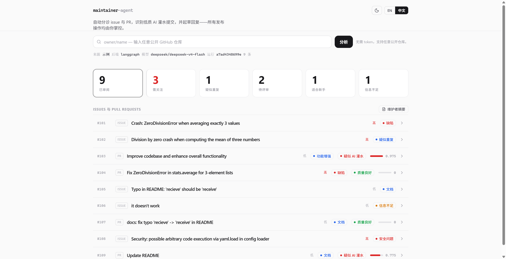
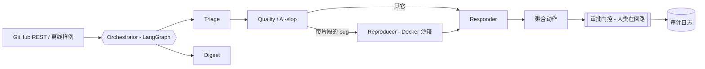

# maintainer-agent

[](https://maintainer-agent.onrender.com)
[](action.yml)
[](LICENSE)

[English](README.md) | [中文](README.zh-CN.md)

**帮助开源维护者对抗 AI slop 的多 Agent 助手。**

2025-2026 年，维护者被 LLM 生成的低质 PR / Issue 淹没（Godot、OCaml、LLVM、以及
GitHub 自己新增的 PR 限流都是对此的回应）。现有工具大多是**被动防御**——过滤、限流、
封顶。`maintainer-agent` 反其道而行：一个**主动、可解释、人类可控**的助手，负责分诊、
质量评估、复现、起草回复——而人始终在关键环节把关。

> 开箱即可**完全离线**运行（内置样例数据 + 确定性规则模型），无需任何凭证即可体验完整流程。

---

## 演示



仪表盘在内置的演示 tracker 上运行完整的多 Agent 流水线：把 PR #103 / #109 标记为疑似 AI slop，识别出 #102 是 #101 的重复，并突出安全 Issue #108——每条都带可展开的证据与一份回复草稿。设计思路见 [docs/WRITEUP.md](docs/WRITEUP.md)。

## 它能做什么

一组协作的 Agent，用 **LangGraph** 编排（无依赖时自动降级为线性执行）逐条处理 Issue/PR：

| Agent | 职责 |
|-------|------|
| **Triage 分诊** | 领域标签 + 优先级、**重复检测**（对全仓做 TF-IDF）、"信息不足"、good-first-issue 识别 |
| **Quality / AI-slop（核心亮点）** | 以仓库 `CONTRIBUTING.md` 作为"岗位说明"，用**带权重的可解释信号**为 PR 打分 |
| **Reproducer 复现** | 在受限的 **Docker 沙箱**里运行 bug 的 Python 片段，判断是否真的复现 |
| **Responder 回复** | 从上述结论起草一条具体、礼貌的回复——未经批准绝不发出 |
| **Digest 摘要** | 30 秒读完的维护者摘要：需关注、重复、可评审、good first issue |

横切设计（让它值得信任的部分）：

- **可解释性**——每个决策都带 verdict、置信度和一串带权重的 `Evidence`。
- **人类在回路**——默认 dry-run；发帖需要 `--apply` **且**逐条批准 **且** `--allow-write` + token。
- **审计日志**——每个判断与动作都追加写入 JSONL，可回放。
- **可靠性评估**——带标注的数据集 + precision/recall/F1，把"看起来聪明"变成可量化的数字。

## 架构



## 快速开始

```bash
pip install -e .

maintainer-agent run --fixtures        # 离线演示，无需 token / API key
maintainer-agent serve                 # 打开仪表盘 http://127.0.0.1:8000
maintainer-agent run --repo pallets/flask --limit 20   # 任意公开仓库（免登录，有限流）
maintainer-agent digest --fixtures     # 生成维护者摘要
maintainer-agent weekly --repo pallets/flask --lang zh  # 生成周报（最近 7 天）
maintainer-agent eval                  # 运行可靠性评估
```

可选增强：`pip install -e ".[all]"`（LangGraph + LLM + FAISS）；复制 `.env.example`
为 `.env` 填入 `DEEPSEEK_API_KEY` / `GITHUB_TOKEN`（均可选）。无 LLM key 时使用确定性
规则模型；有 key 时通过 `litellm` 精修评分与措辞。支持**按 Agent 分配不同模型**
（`MAINTAINER_AGENT_LLM_MODEL_TRIAGE` 等），轻量模型做分诊/摘要，强模型做质量/回复。

### 仪表盘与 API

`serve` 启动 React/Vite + Tailwind CSS 仪表盘。功能：可点击的统计卡片筛选列表、
展开 Issue/PR 详情查看 Agent 决策与证据、交互式审批按钮（打标签/评论/关闭，带确认弹窗）、
追问 Agent、CI 失败日志分析（仅 PR）、贡献者画像（跨 run 记忆）、弹窗式摘要视图。

API 端点：

| 方法 | 路径 | 说明 |
|------|------|------|
| `GET` | `/api/health` | 后端 / LLM / 版本信息 |
| `GET` | `/api/run` | 运行 pipeline，返回结果 + 摘要 |
| `GET` | `/api/audit` | 审计日志 |
| `POST` | `/api/webhook` | GitHub Webhook 自动分诊（HMAC 验证） |
| `POST` | `/api/approve` | 执行建议动作（需 Token） |
| `POST` | `/api/ask` | 追问 Agent（LLM 交互式问答） |
| `POST` | `/api/ci-analyze` | CI 失败日志分析 + LLM 诊断 |
| `GET` | `/api/memory/{repo}/contributors/{author}` | 贡献者跨 run 画像 |
| `GET` | `/api/memory/{repo}/summary` | 仓库汇总记忆统计 |

## 在你的仓库里用（GitHub Action）

给你维护的任意仓库加一个**只读**的每周摘要 + 逐条分诊。它把结果发到 Actions 的
**Summary** 页，不评论、不关闭任何东西。

```yaml
# .github/workflows/maintainer-agent.yml  (参见 examples/workflows/analyze.yml)
name: maintainer-agent
on:
  issues: { types: [opened, reopened] }
  pull_request: { types: [opened, reopened, synchronize] }
  schedule: [{ cron: "0 8 * * 1" }]
  workflow_dispatch:
permissions: { contents: read, issues: read, pull-requests: read }
jobs:
  analyze:
    runs-on: ubuntu-latest
    steps:
      - uses: 0717lee/OSS-Maintainer-Assistant@v1
        with:
          # github-token 默认使用 workflow token——无需显式传入。
          # lang: zh              # 摘要语言：en（默认）或 zh
          # mode: weekly          # 周报模式
          # llm-model: deepseek/deepseek-v4-flash  # 启用真实 LLM（可选）
          # llm-api-key: ${{ secrets.DEEPSEEK_API_KEY }}
          limit: "30"
```

workflow token 默认会传入 Action 容器（与 `actions/stale` 模式一致）；请像上面
一样保持 `permissions:` 只读，或传 `github-token: ""` 完全退出（无认证、受限流）。

不配 `llm-model` 时，Action 完全离线运行，使用确定性规则模型——无需 API key。

## 自托管

```bash
docker compose up --build            # http://localhost:8000
# 或使用已发布的镜像：
docker run -p 8000:8000 ghcr.io/0717lee/oss-maintainer-assistant:latest
```

### 部署一个公开 Demo

Render 一键部署（构建 Dockerfile，自动绑定 `$PORT`，有免费额度）：

[](https://render.com/deploy?repo=https://github.com/0717lee/OSS-Maintainer-Assistant)

在宿主设置 `GITHUB_TOKEN` 可提高限流；`/api/run` 会缓存结果约 2 分钟
（`MAINTAINER_AGENT_CACHE_TTL`）。仪表盘支持 **EN / 中文** 切换。

## 安全模型

- **默认只读**：GitHub 客户端只读；写操作在独立、需显式构造的 `GitHubWriter` 中。
- **默认 dry-run**：动作只是"建议"，不会执行。
- **审批门控**：`--apply` 逐条询问；真实发帖还需 `--allow-write` + token，否则只模拟打印。
- **沙箱隔离**：`--network none`、丢弃全部 capability、只读文件系统、内存/CPU/PID 限制 + 超时；无 Docker 时优雅降级为"跳过"。
- **完整审计**：`.runtime/audit/audit.jsonl`。

## 评估

在内置样例集上（`maintainer-agent eval`）：AI-slop 检测 precision/recall/F1 = 1.00，
重复/优先级/标签准确率 = 1.00。样例集很小，分数偏高是刻意的；用 `--dataset` 指向你
自己的标注做真实测量。

## 技术栈

Python 3.11 · LangGraph · FastAPI · Pydantic v2 · React/Vite + Tailwind CSS · Docker · FAISS/Chroma + litellm（可选）。

设计理念详见 [docs/WRITEUP.md](docs/WRITEUP.md)。许可证：MIT。
